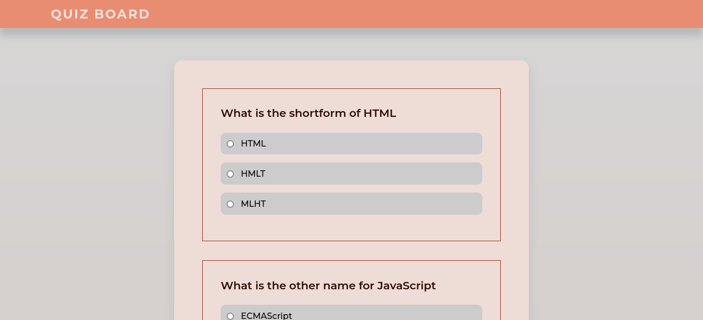

# Quiz_App

## Table of Content

- [Description](#description)
- [Technology Used](#technology-used)
- [Reference](#reference)
- [Licence](#licence)
- [Authors Info](#author-Info)

## Description

This sophisticated quiz application has been expertly designed and developed using the latest HTML, CSS, and JavaScript technologies. Upon submission of the quiz, users are presented with an instant and comprehensive analysis of their results, enabling them to gauge their performance and identify areas for improvement. The application's intuitive and user-friendly interface ensures a seamless experience for users, allowing them to easily navigate through the quiz questions and submit their responses.

### Screenshot

### Requirements

- Either a computer, smartphone, tablet or an Ipad.

- Internet Access.

[Go Back to the top](#Quiz_App)

## Technology

- Semantic HTML5 Markup - Has been used to build the structure of the page.

- CSS Custom properties - Has been used to style the landing page incuding the navigation bar.

- JavaScript - Has been used to create the business logic.

- Figma - Has been used to design the website

### Links

- Live Site URL: [Quiz App](https://qurriahsam.github.io/quizBoard/)

- Figma Design Link: [Figma](https://www.figma.com/file/tZEpwhusyp2RyVkv7Hbely/QuizApp?node-id=0%3A1)

[Go Back to the top](#Quiz_App)

## License

[MIT](./LICENSE) License

[Go Back to the top](#Quiz_App)

## Authors Info

Linked - [Sam Kuria](https://www.linkedin.com/in/sam-kuria-0904b01a1)

[Go Back to the top](#Quiz_App)
